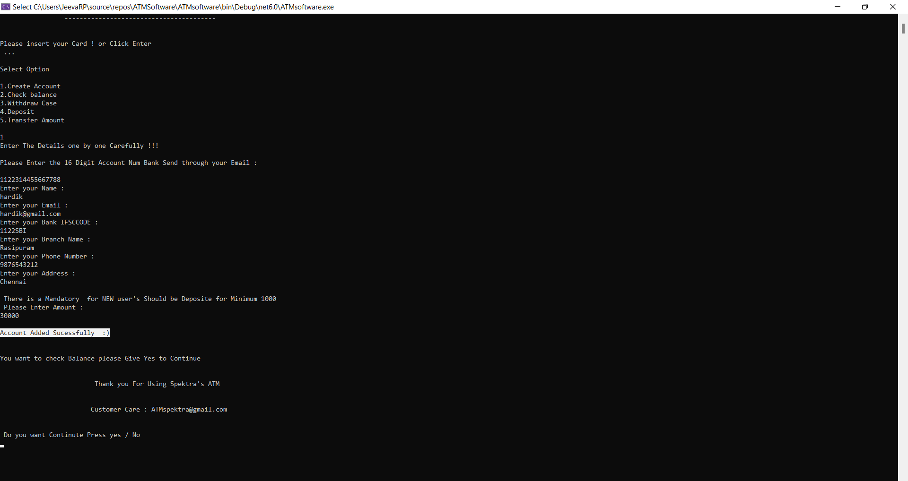
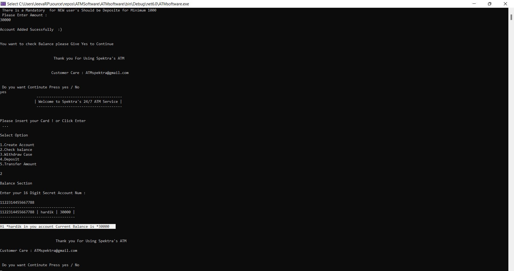
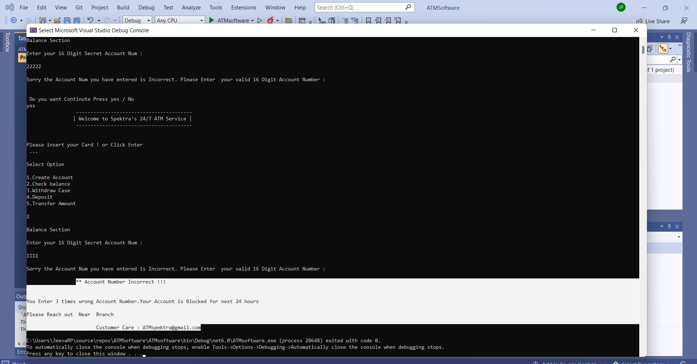
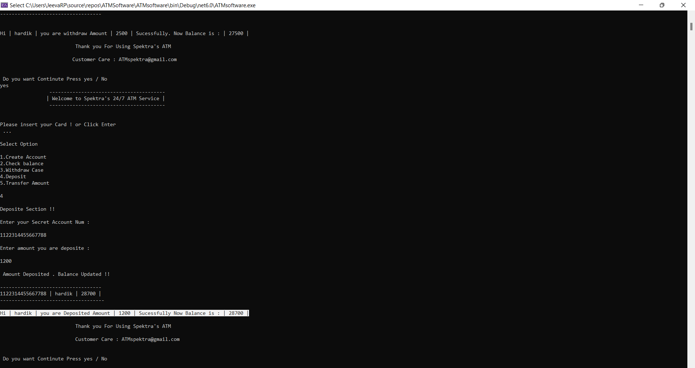
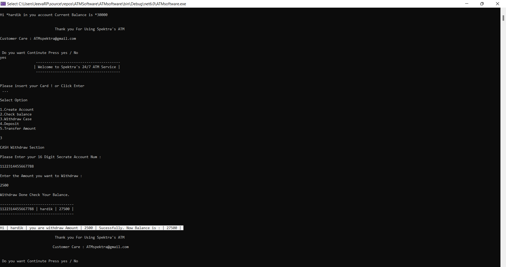
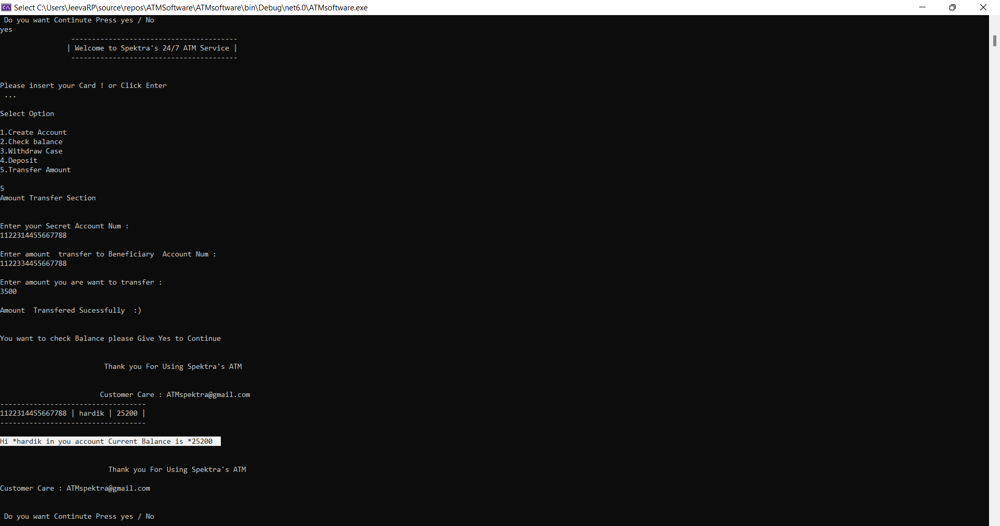
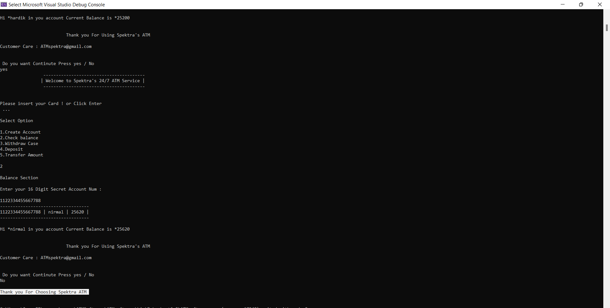

#
#  Project : ATM software

#### Description
Create a Project for ATM software to use user can Experience Most Easy Transaction and Account Creation
#### Function Supports 
 Functions to be supported:

1.Create Account 
  
2.Check balance

3.Deposit money

4.Withdraw money

5.Transfer to another account

#### Program :
```


using System.Text;

using System.Data.SqlClient;

using System.Numerics;

using Microsoft.Extensions.Configuration;

class ATMSoftware
{
    private static IConfiguration _iconfiguration;
    public static void Main(String[] args)
    {
        //Console.WriteLine("We Getting Connect");

        var datasource = @"S-JEEVAP-5CD215\SQLEXPRESS";
        var database = "ATMDataBase";
        string connstring = connstring = @"Data Source=" + datasource + "" +
            "; Initial Catalog=" + database + ";Persist Security Info=True; Integrated Security = SSPI;";

        SqlConnection conn = new SqlConnection(connstring);
        string str;
        BigInteger pin;
        int withdraw;
        int check = 0;
        int count = 0;

        do
        {
            try
            {
                //Console.WriteLine("Opening Connection....");
                conn.Open();
                //Console.WriteLine("Connection Successful ");
                StringBuilder StrBuild = new StringBuilder();

                Console.WriteLine("\t \t ----------------------------------------");
                Console.WriteLine("\t \t| Welcome to Spektra's 24/7 ATM Service | ");
                Console.WriteLine("\t \t ----------------------------------------");
                Console.WriteLine("\n \nPlease insert your Card ! or Click Enter  \n ...");
                Console.ReadLine();
                Console.WriteLine("Select Option \n");
                Console.WriteLine("" +
                    "1.Create Account\n" +
                    "2.Check balance\n" +
                    "3.Withdraw Case\n" +
                    "4.Deposit\n" +
                    "5.Transfer Amount \n");
                BigInteger UserPin;
               
                string Name;
                string Email;
                string IFSCCODE;
                string BranchName;
                long PhoneNo;
                string Address;
                int Input = Convert.ToInt32(Console.ReadLine());


                switch (Input)
                {
                    case 1:

                        Console.WriteLine("\nEnter The Details one by one Carefully !!!\n");

                        Console.WriteLine("Please Enter the 16 Digit New Account Number  Bank Send through your Email : \n");

                        UserPin = Convert.ToInt64(Console.ReadLine());
                        var temp = UserPin;
                        while (temp > 0)
                        {
                            temp = temp / 10;
                            count++;
                        }

                        if (count == 16)
                        {

                            Console.WriteLine("Enter your Name : ");
                            Name = Console.ReadLine();

                            Console.WriteLine("Enter your Email : ");
                            Email = Console.ReadLine();

                            Console.WriteLine("Enter your Bank IFSCCODE : ");
                            IFSCCODE = Console.ReadLine();

                            Console.WriteLine("Enter your Branch Name : ");
                            BranchName = Console.ReadLine();

                            Console.WriteLine("Enter your Phone Number : ");
                            PhoneNo = Convert.ToInt64(Console.ReadLine());

                            Console.WriteLine("Enter your Address : ");
                            Address = Console.ReadLine();

                            Console.WriteLine("\n There is a Mandatory  for NEW user's Should be Deposite" +
                                " for Minimum 1000 \n Please Enter Amount : ");
                            int balance = Convert.ToInt32(Console.ReadLine());

                            StrBuild.Append("exec UserAcctForm '" + UserPin + "','" + Name + "','" + Email + "'," +
                                "'" + IFSCCODE + "','" + BranchName + "'," + PhoneNo + ",'" + Address + "'," + balance + "  ");

                            string SqlQry = StrBuild.ToString();

                            using (SqlCommand cmd = new SqlCommand(SqlQry, conn))
                            {
                                cmd.ExecuteNonQuery();

                                Console.WriteLine("\nAccount Added Sucessfully  :) \n");

                                Console.WriteLine("\nYou want to check Balance please Give Yes to Continue\n");
                                Console.WriteLine("\n\t \t \t Thank you For Using Spektra's ATM \n  \t \t \t " +
                                    " \n \n \t \t \tCustomer Care : ATMspektra@gmail.com ");

                            }
                        }
                        else
                        {
                            UserPin = 0;
                            Console.WriteLine("\nSorry the Account Num you have entered is Incorrect." +
                                " Please Enter  your valid" +
                    " 16 Digit Account Number : ");
                            check++;

                            if (check > 2)
                            {
                                Console.WriteLine("\n \t \t ** Account Number Incorrect !!! \n" +
                                    "\n \t \t \nYou Enter 3 times  Account Number.Your Account is Blocked for next 24 hours" +
                                    "\n \t \t \nPlease Reach out  Near  Branch \n" +
                                    "\n \t \t \tCustomer Care : ATMspektra@gmail.com ");
                                return;
                            }


                        }


                        break;
                    case 2:
                        Console.WriteLine("\nBalance Section ");

                        Console.WriteLine("\nEnter your 16 Digit Secret Account Num : \n");
                        pin = Convert.ToInt64(Console.ReadLine());

                        int count2 = 0;
                        var temp2 = pin;
                        while (temp2 > 0)
                        {
                            temp2 = temp2 / 10;
                            count2++;
                        }
                        if (count2 == 16)
                        {


                            Balance(pin, conn);

                        }
                        else
                        {

                            Console.WriteLine("\nSorry the Account Num you have entered is Incorrect." +
                                " Please Enter  your valid" +
                    " 16 Digit Account Number : ");
                            check++;

                            if (check > 2)
                            {
                                Console.WriteLine("\n \t \t ** Account Number Incorrect !!! \n" +
                                    "\n \t \t \nYou Enter 3 times wrong Account Number.Your Account is Blocked for next 24 hours" +
                                    "\n \t \t \nPlease Reach out  Near  Branch \n" +
                                    "\n \t \t \tCustomer Care : ATMspektra@gmail.com ");
                                return;
                            }


                        }


                        break;
                    case 3:


                        Console.WriteLine("\nCASH Withdraw Section ");
                        Console.WriteLine("\nPlease Enter your 16 Digit Secrate Account Num : \n");
                        pin = Convert.ToInt64(Console.ReadLine());


                        int count3 = 0;
                        var temp3 = pin;
                        while (temp3 > 0)
                        {
                            temp3 = temp3 / 10;
                            count3++;
                        }
                        if (count3 == 16)
                        {
                            Console.WriteLine("\nEnter the Amount you want to Withdraw : \n");
                            withdraw = Convert.ToInt32(Console.ReadLine());

                            withdrawal(pin, withdraw, conn);

                        }
                        else
                        {

                            Console.WriteLine("\nSorry the Account Num you have entered is Incorrect." +
                                " Please Enter  your valid" +
                    " 16 Digit Account Number : ");
                            check++;

                            if (check > 2)
                            {
                                Console.WriteLine("\n \t \t ** Account Number Incorrect !!! \n" +
                                    "\n \t \t \nYou Enter 3 times wrong Account Number.Your Account is Blocked for next 24 hours" +
                                    "\n \t \t \nPlease Reach out  Near  Branch \n" +
                                    "\n \t \t \tCustomer Care : ATMspektra@gmail.com ");
                                return;
                            }


                        }


                        break;
                    case 4:
                        Console.WriteLine("\nDeposite Section !!");
                        Console.WriteLine("\nEnter your Secret Account Num : \n");
                        pin = Convert.ToInt64(Console.ReadLine());


                        int count4 = 0;
                        var temp4 = pin;
                        while (temp4 > 0)
                        {
                            temp4 = temp4 / 10;
                            count4++;
                        }
                        if (count4 == 16)
                        {
                            Console.WriteLine("\nEnter the Amount you want to Deposite : \n");

                            int depositeamount = Convert.ToInt32(Console.ReadLine());

                            DespositeSection(pin, depositeamount, conn);

                        }
                        else
                        {

                            Console.WriteLine("\nSorry the Account Num you have entered is Incorrect." +
                                " Please Enter  your valid" +
                    " 16 Digit Account Number : ");
                            check++;

                            if (check > 2)
                            {
                                Console.WriteLine("\n \t \t ** Account Number Incorrect !!! \n" +
                                    "\n \t \t \nYou Enter 3 times wrong Account Number.Your Account is Blocked for next 24 hours" +
                                    "\n \t \t \nPlease Reach out  Near  Branch \n" +
                                    "\n \t \t \tCustomer Care : ATMspektra@gmail.com ");
                                return;
                            }


                        }


                        break;
                    case 5:
                        Console.WriteLine("Amount Transfer Section\n");
                        Console.WriteLine("\nEnter your Secret Account Num : \t");
                        pin = Convert.ToInt64(Console.ReadLine());
                        Console.WriteLine("\nEnter amount  transfer to Beneficiary  Account Num : \t");
                        BigInteger pin2 = Convert.ToInt64(Console.ReadLine());


                        int count5 = 0;
                        var temp5 = pin;
                        while (temp5 > 0)
                        {
                            temp5 = temp5 / 10;
                            count5++;
                        }
                        if (count5 == 16)
                        {
                            Console.WriteLine("\nEnter amount you are want to transfer : \t");
                            int trans = Convert.ToInt32(Console.ReadLine());

                            Transfer(pin, pin2, trans, conn);
                        }
                        else
                        {

                            Console.WriteLine("\nSorry the Account Num you have entered is Incorrect." +
                                " Please Enter  your valid" +
                    " 16 Digit Account Number : ");
                            check++;
                            if (check > 2)
                            {
                                Console.WriteLine("\n \t \t ** Account Number Incorrect !!! \n" +
                                    "\n \t \t \nYou Enter 3 times wrong Account Number.Your Account is Blocked for next 24 hours" +
                                    "\n \t \t \nPlease Reach out  Near  Branch \n" +
                                    "\n \t \t \tCustomer Care : ATMspektra@gmail.com ");
                                return;
                            }

                        }
                        break;
                }
                StrBuild.Clear();
            }
            catch (Exception e)
            {
                Console.WriteLine("Error :" + e.Message);
            }
            conn.Close();
            Console.WriteLine("\n \n Do you want Continute Press yes / No\n");
            str = Console.ReadLine();
            if (str != "yes")
            {
                Console.WriteLine("\t \t" + str + "\n \t Please Enter Valid Input Yes / NO");
            }
            else
            {
                Console.WriteLine("Yes You can\n");
            }
        }
        while (str == "yes");

        Console.WriteLine("\nThank you For Choosing Spektra ATM\n");
    }
    static void withdrawal(BigInteger pin, int amount, SqlConnection conn)
    {
        StringBuilder StrBuild = new StringBuilder();
        StrBuild.Append("exec withdraw '" + pin + "','" + amount + "' ");
        string SqlQry = StrBuild.ToString();

        using (SqlCommand cmd = new SqlCommand(SqlQry, conn))

        {
            SqlDataReader reader = cmd.ExecuteReader();

            while (reader.Read())
            {
                Console.WriteLine("\nWithdraw Done Check Your Balance.\n \a");
                Console.WriteLine("-----------------------------------");
                Console.WriteLine("{0} | {1} | {2} |", reader.GetInt64(0), reader.GetString(1),
                        reader.GetInt32(2));
                Console.WriteLine("----------------------------------- \n");
                Console.WriteLine("\nHi | {0} | you are withdraw Amount | {1} | Sucessfully. Now Balance is : | {2} |", reader.GetString(1), amount, reader.GetInt32(2));

            }
            reader.ToString(); Console.WriteLine("\n\t \t \t  Thank you For Using Spektra's ATM \n  \t \t \t " +
                " \n \t \t \t Customer Care : ATMspektra@gmail.com ");
        }

    }
    static void Balance(BigInteger pin, SqlConnection conn)
    {
        StringBuilder StrBuild = new StringBuilder();
        StrBuild.Append("exec checkbalance'" + pin + "' ");
        string SqlQry = StrBuild.ToString();
        using (SqlCommand cmd = new SqlCommand(SqlQry, conn))

        {
            SqlDataReader reader = cmd.ExecuteReader();

            while (reader.Read())
            {
                Console.WriteLine("-----------------------------------");
                Console.WriteLine("{0} | {1} | {2} |", reader.GetInt64(0), reader.GetString(1),
                        reader.GetInt32(2));
                Console.WriteLine("-----------------------------------\n");
                Console.WriteLine("Hi *{0} in you account Current Balance is *{1} \n ",
                    reader.GetString(1),
                        reader.GetInt32(2));
            }
            reader.ToString();
            Console.WriteLine("\n\t \t \t  Thank you For Using Spektra's ATM \n  \t \t \t " +
                                            " \nCustomer Care : ATMspektra@gmail.com ");
        }

    }
    static void DespositeSection(BigInteger pin, int deposite, SqlConnection conn)
    {
        StringBuilder StrBuild = new StringBuilder();
        StrBuild.Append("exec deposite '" + pin + "','" + deposite + "' ");
        string SqlQry = StrBuild.ToString();
        using (SqlCommand cmd = new SqlCommand(SqlQry, conn))

        {
            SqlDataReader reader = cmd.ExecuteReader();

            while (reader.Read())
            {
                Console.WriteLine("\n Amount Deposited . Balance Updated !! \n \a");
                Console.WriteLine("-----------------------------------");
                Console.WriteLine("{0} | {1} | {2} | ", reader.GetInt64(0), reader.GetString(1),
                        reader.GetInt32(2));
                Console.WriteLine("------------------------------------");
                Console.WriteLine("\nHi | {0} | you are Deposited Amount | {1} | Sucessfully Now Balance is : " +
                    "| {2} |", reader.GetString(1), deposite, reader.GetInt32(2));
            }
            reader.ToString();

            Console.WriteLine("\n\t \t \t  Thank you For Using Spektra's ATM \n  \t \t \t " +
                " \n \t \t \t  Customer Care : ATMspektra@gmail.com ");

        }

    }
    static void Transfer(BigInteger pin, BigInteger pin2, int trans, SqlConnection conn)
    {
        StringBuilder StrBuild = new StringBuilder();
        StrBuild.Append("exec MoneyTransfer '" + pin + "'," + pin2 + ",'" + trans + "' ");
        string SqlQry = StrBuild.ToString();

        using (SqlCommand cmd = new SqlCommand(SqlQry, conn))

        {
            cmd.ExecuteNonQuery();
            Console.WriteLine("\nAmount  Transfered Sucessfully  :) \n");
            Console.WriteLine("\nYou want to check Balance please Give Yes to Continue\n");
            Console.WriteLine("\n\t \t \t Thank you For Using Spektra's ATM \n  \t \t \t " +
                " \n \n \t \t \tCustomer Care : ATMspektra@gmail.com ");

        }
        if (trans != null)
        {
            using (SqlCommand cmd = new SqlCommand("exec checkbalance '" + pin + "' ", conn))

            {
                SqlDataReader reader = cmd.ExecuteReader();

                while (reader.Read())
                {


                    Console.WriteLine("-----------------------------------");
                    Console.WriteLine("{0} | {1} | {2} |", reader.GetInt64(0), reader.GetString(1),
                            reader.GetInt32(2));
                    Console.WriteLine("-----------------------------------\n");
                    Console.WriteLine("Hi *{0} in you account Current Balance is *{1} \n ",
                        reader.GetString(1),
                            reader.GetInt32(2));
                }
                reader.ToString();
                Console.WriteLine("\n\t \t \t  Thank you For Using Spektra's ATM \n  \t \t \t " +
                                                " \nCustomer Care : ATMspektra@gmail.com ");
            }
        }

    }


    

}


```

#### Output ScreenShots :

1.Create Account 
  
  
  
2.Check balance

  
  
  * Account Block

  

3.Deposit money

  

4.Withdraw money

  

5.Transfer to another account

  

* After Transfer

  

* END Thanks

  
